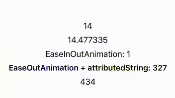

# IncrementableLabel

[](https://travis-ci.org/recisio/IncrementableLabel)

[](https://github.com/recisio/IncrementableLabel)
[](http://cocoadocs.org/docsets/IncrementableLabel)


IncrementableLabel is the easiest way to have incrementable numbers in an UILabel!



## Usage

```swift
let myIncrementableLabel = IncrementableLabel(frame: CGRect(x: 0, y: 0, width: 100, height: 50))
myIncrementableLabel.incrementFromValue(0, toValue: 100, duration: 1)
```

Check the sample project for advanced usage

## Installation

- iOS 8.0+
- tvOS 9.0+

### CocoaPods Installation

IncrementableLabel is available on CocoaPods. Just add the following to your Podfile:

```
pod 'IncrementableLabel'
```

### Swift Package Manager

IncrementableLabel is available on SPM. Just add the following to your Package file:

```swift
import PackageDescription

let package = Package(
    dependencies: [
        .Package(url: "https://github.com/recisio/IncrementableLabel.git", majorVersion: 1)
    ]
)
```

### Manual Installation

Just drag the `Source/*.swift` files into your project.


## IncrementableLabel properties

```swift
var option: IncrementableLabelOptions = .Linear
```

An options indicating how you want to perform the incrementation:
- Linear
- EaseIn
- EaseOut
- EaseInOut

```swift
typealias StringFormatter = (Float) -> String
var stringFormatter: StringFormatter?

typealias AttributedTextFormatter = (Float) -> NSAttributedString
var attributedTextFormatter: AttributedTextFormatter?
```

A callback closure which permits a greater control on how the text (attributed or not) is formatted between each incrementation.


```swift
typealias IncrementableLabelCompletion = () -> Void
var incrementationCompletion: IncrementableLabelCompletion?
```

A callback closure that will be called once the incrementation is finished.

```swift
var easingRate: Float = 3.0
```

The rate used when an `option` is used.

```swift
var format: String = "%d"
```

The format is used to set the text in the label. You can set the format to `%f` in order to display decimals.

## IncrementableLabel methods

```swift
public func currentValue() -> Float
```

The label's value during the incrementation 

```swift
func incrementFromValue(fromValue: Float, toValue: Float, duration: Float = 0.3)
```

Starts the incrementation `fromValue` to `toValue`. The duration by default will be 0.3

```swift
func incrementFromCurrentValueToValue(toValue: Float, duration: Float = 0.3)
```

Starts the incrementation from the current value to `toValue`. The duration by default will be 0.3

```swift
func incrementFromZero(toValue: Float, duration: Float = 0.3)
```

Starts the incrementation from zero to `toValue`. The duration by default will be 0.3

## What's next

- [ ] IBDesignable
- [ ] Tests
- Your features!

## Contribution

- If you found a **bug**, open an **issue**
- If you have a **feature request**, open an **issue**
- If you want to **contribute**, submit a **pull request**

## Licence

IncrementableLabel is available under the MIT license. See the LICENSE file for more info.
